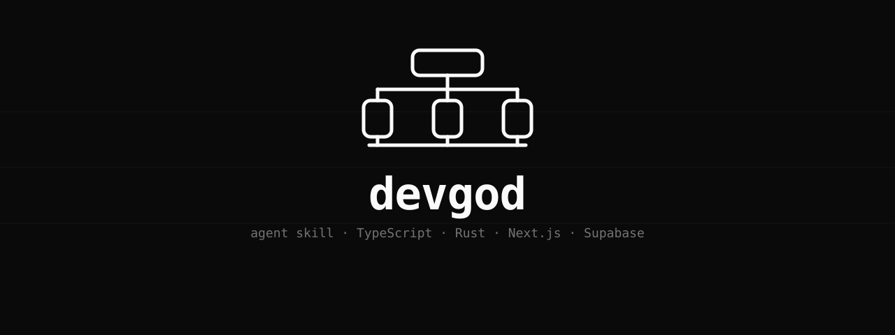
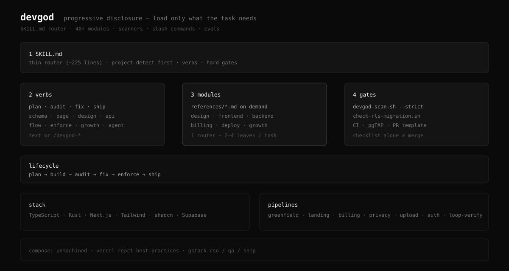
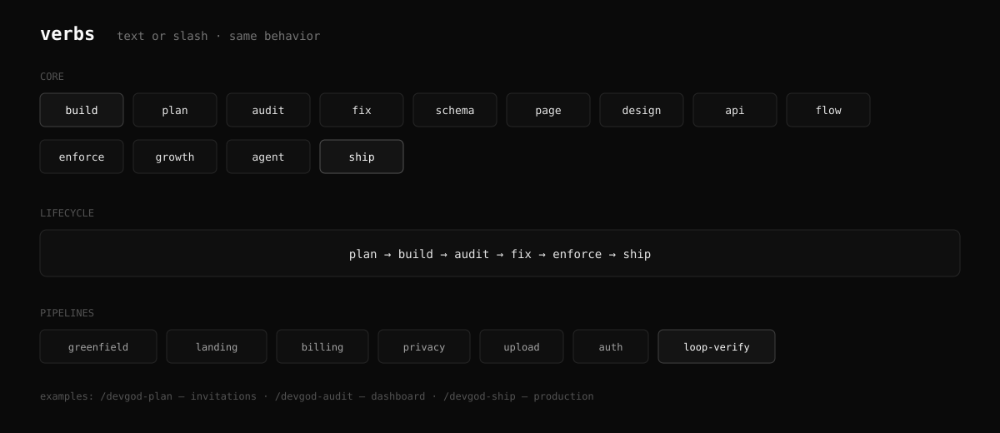
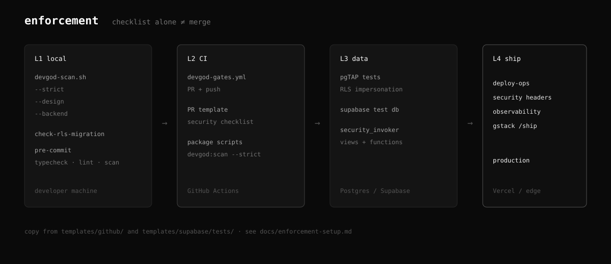

# devgod

Open, standalone product-engineering skill for coding agents, covering [TypeScript](https://www.typescriptlang.org/), [Python](https://www.python.org/), [Rust](https://www.rust-lang.org/), [Next.js](https://nextjs.org/), [Tailwind](https://tailwindcss.com/), [shadcn/ui](https://ui.shadcn.com/), and [Supabase](https://supabase.com/).

[](https://github.com/0xNyk/devgod/actions/workflows/validate.yml)
[](LICENSE)
[](https://github.com/0xNyk/devgod)

Thin `SKILL.md` router. The agent loads only the modules the task needs (design, RLS, billing, ship, deep research, and the rest), plus scanners, CI templates, slash commands, and evals.

```
research → plan → build → browser QA → measure → enforce → ship → improve
```

```
$ # without a router, agents invent stack habits and skip gates
$ # with devgod:
devgod plan - multi-tenant org invitations
devgod research - queue libraries for Next SaaS
devgod audit - app/api and Server Actions
devgod ship - production readiness
```

In Codex, explicitly select the skill with `$devgod audit <target>`. In Claude
Code, use `/devgod audit <target>`. For the full command alias catalog, run
`bash scripts/install-commands.sh --hosts codex,claude,cursor,grok,hermes`.
Aliases use `/devgod-audit` in those hosts except Codex, which requires
`/prompts:devgod-audit`. [All hosts and commands](docs/slash-commands.md).

## Install

```bash
git clone https://github.com/0xNyk/devgod.git
cd devgod
bash scripts/install-all-agents.sh
```

Links the same native skill package into detected host directories. Supports Codex,
Claude Code, Grok, Hermes, Cursor, Gemini CLI, OpenCode, and shared Agent Skills.
Select hosts explicitly with `--hosts codex,claude,grok,hermes,cursor`; preview with
`--dry-run`. Existing conflicting installations are preserved. Global instructions,
memory, and slash aliases are separate from native installation.

[Native installation and discovery checks](docs/native-skills.md) cover profile
paths, other hosts, and the limits of installation verification.

Unaffiliated with Anthropic; Claude and Claude Code are trademarks of Anthropic, PBC.

```bash
export DEVGOD=/path/to/devgod
bash "$DEVGOD/scripts/install-all-agents.sh"
```

Plain text works: `devgod plan - …`. Full list: [docs/slash-commands.md](docs/slash-commands.md).

## How it works

```
devgod <verb> <task>
        │
        ▼
  project-detect → SKILL.md route
        │
        ▼
  load 1 router + 2-4 leaf modules
        │
        ▼
  build / audit / ship  (+ scanners when gated)
```

```
devgod/
  SKILL.md           # router only
  references/        # modules on demand
  commands/          # /devgod-* slash
  scripts/           # scan · RLS · install · validate
  templates/         # CI · pgTAP · package scripts
  evals/             # routing and regression scenarios
  docs/              # humans (agents do not bulk-load this)
```



## Verbs



| Verb | What |
|---|---|
| `devgod <task>` | Plan and build |
| `devgod plan` | Architecture + file plan; no code until approved |
| `devgod audit` | Rubric score; report only |
| `devgod fix` | Audit, then small repairs |
| `devgod schema` | Database + RLS + migration plan |
| `devgod page` | Landing / conversion page |
| `devgod design` | Design system + a11y audit |
| `devgod api` | API + data flow plan |
| `devgod flow` | Cross-service data flow |
| `devgod enforce` | Wire scanners + CI into a repo |
| `devgod growth` | Funnel, activation, retention |
| `devgod agent` | Prompt / spec help for coding agents |
| `devgod memory` | Durable memory admission, retrieval, expiry, and deletion review |
| `devgod research` | Deep-research outline (items + fields) |
| `devgod research-deep` | Parallel deep agents → validated JSON |
| `devgod research-report` | Results → `report.md` |
| `devgod browser` | Safe browser evidence and E2E promotion |
| `devgod qa` | Systematic product QA and repair loop |
| `devgod launch` | Product launch surfaces through activation and QA |
| `devgod business` | Stated product/business goal → executable software system |
| `devgod kpi` | KPI tree, event contracts, dashboards, data quality |
| `devgod self-improve` | Audit and optimize devgod itself |
| `devgod ship` | Deploy + security + enforcement pre-flight |

Pipelines: `greenfield`, `landing`, `billing`, `privacy`, `upload`, `auth`, `research`, `browser`, `launch`, `business`, `loop-verify`.
Deep research adapted from [Weizhena/Deep-Research-skills](https://github.com/Weizhena/Deep-Research-skills) (MIT); see [third-party notices](THIRD_PARTY_NOTICES.md).
More prompts: [docs/verbs.md](docs/verbs.md).

## Wire enforcement into a project



```bash
export DEVGOD=/path/to/devgod

mkdir -p scripts supabase/tests .github/workflows .github

cp "$DEVGOD/scripts/devgod-scan.sh" scripts/
cp "$DEVGOD/scripts/check-rls-migration.sh" scripts/
cp "$DEVGOD/templates/github/devgod-gates.yml" .github/workflows/
cp "$DEVGOD/templates/github/pull_request_template.md" .github/
cp "$DEVGOD/templates/supabase/tests/"*.sql supabase/tests/

chmod +x scripts/*.sh
```

Merge [templates/package-scripts.snippet.json](templates/package-scripts.snippet.json), then:

```bash
npm run devgod:scan
npm run devgod:scan -- --strict
```

Details: [docs/enforcement-setup.md](docs/enforcement-setup.md).

## When not to use this

- **The task is general company/CEO strategy.** devgod handles product engineering, including GTM/KPI/revenue implementation. It does not handle fundraising, portfolio management, or founder coaching.
- **The stack is outside TS/Python/Rust web products.** `project-detect` will scope or decline; do not force the modules onto a different stack.
- **You only need one rule.** Install the thin companion while keeping devgod standalone. [unmachined](https://github.com/0xNyk/unmachined) is devgod's default quality gate for human-facing text and UI.
- **You want a free-form brainstorm.** Use a plan verb and stop there, or use a different tool. devgod is for shipping constraints, not vibe sessions.

## Composition

| Skill | Use for |
|---|---|
| **devgod** | Standalone product engineering, browser QA, launch, analytics, and ship gates |
| [**unmachined**](https://github.com/0xNyk/unmachined) | Default text/UI anti-slop gate with deterministic scanners |
| [**Council of High Intelligence**](https://github.com/0xNyk/council-of-high-intelligence) | Optional structured deliberation for consequential ambiguous engineering decisions |
| **react-best-practices** | React / Next performance (Vercel skill) |
| **gstack** | Optional deeper `/cso`, exploratory `/qa`, and `/ship` runtime |

Install optional companions from their canonical repositories at a reviewed commit SHA. Inspect
their skill instructions, scripts, hooks, dependencies, and requested permissions before linking
them into a trusted host. Do not use a floating package runner for installation.

## Docs

| Doc | For |
|---|---|
| [docs/getting-started.md](docs/getting-started.md) | First session |
| [docs/verbs.md](docs/verbs.md) | Verb reference |
| [docs/slash-commands.md](docs/slash-commands.md) | `/devgod-*` + loops |
| [docs/enforcement-setup.md](docs/enforcement-setup.md) | CI / pre-commit |
| [docs/architecture.md](docs/architecture.md) | How the skill loads |
| [docs/modules.md](docs/modules.md) | Module map |
| [references/MANIFEST.md](references/MANIFEST.md) | Agent index |
| [assets/BRAND.md](assets/BRAND.md) | Brand |
| [CONTRIBUTING.md](CONTRIBUTING.md) | Adding modules |

## Trust

Skills and their scripts run with your own user privileges inside your agent host. Read `SKILL.md`, `scripts/`, and the slash commands before installing, and pin the clone to a reviewed commit. This repository runs a leak and dropper gate in CI (`scripts/check-oss-leaks.sh`, `scripts/validate-repo.sh`) to detect private context, remote-install patterns, and secret literals. These checks reduce risk; they do not prove that a checkout or its Git history is free of sensitive material. See [SECURITY.md](SECURITY.md) for the supply-chain rules and reporting channel.

## Telemetry

None by default. devgod sends no network beacons and collects nothing during ordinary use. The optional evaluation ledger (`references/devgod-telemetry.md`) is local-only, explicit, and records low-cardinality metadata from eval receipts; it never captures prompts, responses, code, paths, identities, or tool arguments.

## Validate

```bash
bash scripts/validate-repo.sh
```

CI also runs [unmachined](https://github.com/0xNyk/unmachined)'s `scan_text.py` on this README and the human docs so shipped prose stays under the slop threshold.

## Links

- [SECURITY.md](SECURITY.md) · [SUPPORT.md](SUPPORT.md) · [CHANGELOG.md](CHANGELOG.md) · [CONTRIBUTING.md](CONTRIBUTING.md)
- [Releases](https://github.com/0xNyk/devgod/releases)

## License

[MIT](LICENSE) © 2026 0xNyk
